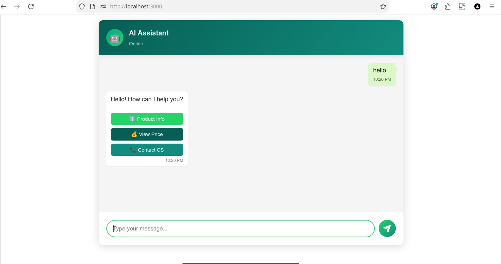

# Chat UI App with el.js & Ollama Integration

[](https://ko-fi.com/gugusdarmayanto)

A modern chat interface application with **Ollama AI integration**, built with **el.js** - a lightweight, chainable DOM manipulation library. Features WhatsApp-inspired design, persistent conversation history, and optimized context management for fast AI responses.



## 📝 About

This project demonstrates how to create a production-ready chat application using el.js for DOM manipulation and Ollama for AI-powered conversations. It showcases advanced UI patterns including session management, smart context optimization, dual-layout modes, and WhatsApp-style speech bubbles.

## ✨ Features

### Core Chat Functionality
- 💬 Real-time messaging interface with streaming responses
- 🤖 **Ollama AI Integration** with multiple model support
- ⏱️ Typing indicators with animated dots
- 🕐 Message timestamps
- 🗨️ WhatsApp-style speech bubbles with triangular pointers

### 🆕 Session Management
- 📋 **Conversation History Sidebar** - Browse all chat sessions
- 🔍 **Session Switching** - Click to switch between conversations instantly
- 🗑️ **Delete Sessions** - Remove unwanted conversations with confirmation
- ➕ **New Chat Button** - Start fresh conversations without page reload
- 💾 **Persistent Storage** - All conversations saved to SQLite database
- 🎯 **Clean Start** - No pre-selected session on initial load

### 🚀 Performance Optimizations
- ⚡ **Smart Context Management** - Summary + recent messages pattern
- 🧠 **Auto-Summarization** - AI-powered conversation compaction
- 📊 **Dynamic Context Sizing** - Optimal token usage (4000-8192 tokens)
- 🎯 **Token-Aware Building** - Stay within model context limits
- 🔄 **Auto-Compaction** - Triggered at 75% capacity threshold
- ⚙️ **Model Parameter Tuning** - Temperature 0.7, top_p 0.9

### 📦 Data Persistence
- 💿 **SQLite Database** - Reliable local storage
- 📂 **Per-Session Isolation** - Strict context separation
- 🔄 **Auto-Refresh** - History updates after first message
- 🗄️ **Message Metadata** - Timestamps, counts, session info

### Dual Display Modes
- 🖥️ **Full Mode**: Centered large chat window (800px × 600px)
- 📱 **Popup Mode**: Compact floating widget with toggle button

### UI/UX Highlights
- 🎨 WhatsApp-inspired color scheme (teal header, green accents)
- 🌈 Fully customizable color themes via configuration
- ✨ Smooth animations and transitions
- 📱 Responsive design for all screen sizes
- 🔘 Floating action button for popup mode
- ❌ Close button in popup header
- 🎯 Configurable border radius (0px to any value)
- 🎨 Custom background colors
- 💫 Customizable box shadows
- 🤖 Custom bot name and icon (emoji or HTML)

### Advanced API Integration
- 🔌 Built-in `onChat` callback for API integration
- ⚡ Async/await support for streaming API calls
- 🔄 Real-time response streaming from Ollama
- 🔁 Automatic retry mechanism with exponential backoff
- ⏱️ Configurable typing delay
- ❌ Error handling with custom messages
- 🎭 Multiple response types:
  - **Plain Text**: Simple string responses
  - **HTML String**: Rich HTML content with interactive elements
  - **el.js Object**: Custom UI components built with el.js
- 💉 Dependency injection pattern for clean code:
  - `onChat: async (message, onStream, sendQuickReply) => {}`
  - No global variables needed
  - Scoped function access via closure

### 🤖 Ollama Features
- 📚 **Model Selection Dropdown** - Choose from available Ollama models
- 🔄 **Live Model List** - Fetched from Ollama API on startup
- ⚡ **Streaming Responses** - Real-time text generation display
- 🧠 **Context Awareness** - Smart history management per session
- 🎯 **Optimized Prompts** - Balanced creativity and coherence

## 🚀 Quick Start

### Prerequisites

1. **Install Ollama** (if not already installed):
   ```bash
   # Linux/Mac
   curl -fsSL https://ollama.com/install.sh | sh
   
   # Windows - Download from https://ollama.com
   ```

2. **Pull a Model** (e.g., Llama 3.2):
   ```bash
   ollama pull llama3.2:latest
   ```

3. **Start Ollama Server**:
   ```bash
   ollama serve
   ```

### 1. Using Local Server (Recommended)

```bash
# Install dependencies (if needed)
npm install

# Start the server
node index.js

# Open in browser
http://localhost:3000
```

### 2. Direct Browser Opening

Simply open `index.html` in your browser (limited functionality without backend).

## ⚙️ Configuration

### UI Configuration

Customize the chat appearance in `index.html` (lines 25-45):

```javascript
const chatConfig = {
  type: 'full',                   // 'full' or 'popup'
  
  // Size configuration
  full: {
    width: '800px',               // Full mode width
    height: '600px'               // Full mode height
  },
  popup: {
    width: '350px',               // Popup mode width
    height: '450px'               // Popup mode height
  },
  
  // Appearance configuration
  background: '#ffffff',          // Background color
  borderRadius: '12px',           // Border radius ('0px' for no radius)
  boxShadow: undefined,           // Custom box shadow (optional)
  botName: 'AI Assistant',        // Bot name displayed in header
  botIcon: '🤖',                  // Bot icon (emoji or HTML)
  
  // Color configuration
  primaryColor: '#25D366',        // Send button, focus border
  secondaryColor: '#128C7E',      // Gradient partner
  userMessageColor: '#DCF8C6',    // User message bubbles
  botAvatarColor1: '#00A884',     // Bot avatar gradient start
  botAvatarColor2: '#25D366',     // Bot avatar gradient end
  headerGradient1: '#075E54',     // Header gradient start
  headerGradient2: '#128C7E',     // Header gradient end
  
  // Chat callback configuration
  typingDelay: 1000,              // Typing indicator delay (ms)
  retryMessage: "Error message",  // Custom error message
  
  // onChat callback with dependency injection
  onChat: async (message, onStream, sendQuickReply) => {
    // Simulate API delay
    await new Promise(resolve => setTimeout(resolve, 1500));
    
    // ✅ Response Type 1: Plain Text
    return `Response to: ${message}`;
    
    // ✅ Response Type 2: HTML String
    /*
    return `
      <div>
        <p>Halo! Ada yang bisa saya bantu?</p>
        <button onclick="sendQuickReply('Info')">ℹ️ Info</button>
      </div>
    `;
    */
    
    // ✅ Response Type 3: el.js Object (Custom UI)
    /*
    const buttonGroup = el('div')
      .css({'display': 'flex', 'gap': '8px'});
    
    const btnInfo = el('button')
      .text('ℹ️ Info')
      .css({'background': '#25D366', 'color': 'white'})
      .click(() => sendQuickReply('Info produk'));
    
    buttonGroup.child([btnInfo]);
    
    const customUI = el('div').child([
      el('p').text('Halo! Ada yang bisa saya bantu?'),
      buttonGroup
    ]);
    
    return { el: customUI };
    */
    
    // ✅ Streaming Response
    /*
    onStream("Hello");
    onStream(" World!");
    return; // Return undefined when streaming
    */
  }
};
```

### 🤖 Ollama Configuration

The app automatically integrates with Ollama. Key features:

**Model Selection**: Dropdown populated from available Ollama models
**Context Optimization**: Automatic smart management (4000-8192 tokens)
**Session Isolation**: Each conversation has separate context
**Auto-Summarization**: AI-powered compaction for long conversations

**Performance Parameters** (configured in `ollama-chat.js`):
```javascript
{
  num_ctx: 4096,          // Context window size (dynamic: 4096-8192)
  temperature: 0.7,       // Creativity vs coherence balance
  top_p: 0.9             // Nucleus sampling quality
}
```

**Context Management Strategy**:
- **Recent Messages**: Keep last 10 messages in memory
- **Auto-Summary**: Triggered at 15+ messages
- **Token Limit**: Max 4000 tokens per request
- **Compaction**: Auto-compact at 75% capacity

## 📁 Project Structure

```
chat-ui/
├── index.html          # Main HTML file with UI configuration
├── index.js            # HTTP server + Ollama API proxy
├── database.js         # SQLite database wrapper
├── el.js              # el.js DOM manipulation library
├── ollama-chat.js     # Ollama integration & session management
└── chat-ui/
    └── chat-ui.js      # Chat app logic (exported function)

data/
└── chat-history.db    # SQLite database for conversation history
```

## 🔌 API Endpoints

### Ollama APIs (Proxy)

```bash
GET  /api/ollama/tags          # List available models
GET  /api/ollama/ps            # List running models
GET  /api/ollama/version       # Ollama version info
POST /api/ollama/generate      # Generate text completion
POST /api/ollama/chat          # Chat completion (streaming)
```

### Conversation History APIs (SQLite)

```bash
GET    /api/conversations                 # List all sessions
GET    /api/conversations?session_id=X    # Get session messages
POST   /api/conversations                 # Add message to session
DELETE /api/conversations/:id             # Delete entire session
GET    /api/stats                         # Get database statistics
```

### Example Usage

**Send a Message**:
```javascript
const response = await fetch('/api/conversations', {
  method: 'POST',
  headers: { 'Content-Type': 'application/json' },
  body: JSON.stringify({
    session_id: 'session_123',
    role: 'user',
    content: 'Hello, how are you?'
  })
});
```

**Load Conversation History**:
```javascript
const response = await fetch(`/api/conversations?session_id=session_123`);
const data = await response.json();
console.log(data.history); // Array of messages
```

**Delete a Session**:
```javascript
await fetch('/api/conversations/session_123', {
  method: 'DELETE'
});
```

## 💡 How It Works

### Architecture Overview

The application consists of three layers:

1. **Frontend UI** (`chat-ui.js`, `el.js`) - User interface and DOM manipulation
2. **Session Management** (`ollama-chat.js`) - Ollama integration, history loading, context optimization
3. **Backend Server** (`index.js`, `database.js`) - HTTP server, API proxy, SQLite persistence

### Chat Flow

```javascript
// 1. User sends message
User types "Hello" → Click send

// 2. Save to database
POST /api/conversations
  → SQLite stores message
  → Returns message ID

// 3. Send to Ollama (with optimized context)
POST /api/ollama/chat
  Body: {
    model: "llama3.2",
    messages: [
      // Smart context: summary + recent messages
      { role: 'system', content: 'Previous context summary: ...' },
      { role: 'user', content: 'Recent message 1' },
      { role: 'assistant', content: 'Recent response 1' },
      // ... more recent messages
      { role: 'user', content: 'Hello' } // New message
    ],
    stream: true
  }

// 4. Stream response back
Ollama → Backend → Frontend
  Chunk by chunk in real-time

// 5. Save response to database
POST /api/conversations
  → Stores AI response for future context
```

### Session Management

**Per-Session Isolation**:
```javascript
// Each session has isolated conversation history
Session A: ["Hello", "Hi there!"]
Session B: ["What is JS?", "JavaScript is..."]

// Switching sessions loads fresh context
Click Session B → 
  Load from DB → 
  Clear memory → 
  Set new context → 
  Ready for chat
```

**Context Optimization** (for fast responses):
```javascript
// Before sending to Ollama:
conversationHistory = loadFromDB(); // e.g., 50 messages

// Build optimized context:
context = buildContext();
  → Summarize old messages (if > 15)
  → Keep recent 10 messages
  → Limit to 4000 tokens max
  → Result: ~12 messages sent to Ollama

// Ollama receives compact, relevant context
// → Faster response times
// → Lower memory usage
// → Better performance
```

### Key el.js Usage Patterns

```javascript
// Create elements with chaining
const container = el('div')
    .id('chat-app')
    .css({ 
        'max-width': chatType === 'full' ? config.full.width : config.popup.width,
        'height': chatType === 'full' ? config.full.height : config.popup.height
    });

// Add children properly
container.child([header, messagesContainer, inputArea]);

// Call get() to append to DOM
container.get();

// For dynamic content, manipulate DOM directly
messagesContainer.el.appendChild(messageElement.get());

// Event delegation for dynamic lists
chatList.el.addEventListener('click', function(e) {
  const item = e.target.closest('[data-session-id]');
  if (item) {
    // Handle session click
  }
});
```

## ⚡ Performance Tips

### Optimizing Ollama Response Speed

**Context Window Size** (biggest impact):
```javascript
// Smaller context = Faster response
num_ctx: 2048   → Very fast ⚡⚡
num_ctx: 4096   → Balanced ⚡
num_ctx: 8192   → Slower but more context 🐌

// Our implementation uses dynamic sizing:
const optimalContextSize = Math.max(4096, Math.min(totalTokens + 1024, 8192));
```

**Model Selection**:
```javascript
llama3.2:1b   → Fastest ⚡⚡⚡ (but less capable)
llama3.2:3b   → Fast ⚡⚡ (good balance)
llama3.2:7b   → Medium ⚡ (more accurate)
llama3.2:70b  → Slowest 🐢 (most capable)
```

**Temperature** (no speed impact, only creativity):
```javascript
temperature: 0.3  → Focused, deterministic
temperature: 0.7  → Balanced (our default)
temperature: 1.0  → Creative, varied
```

**Token Count** (direct correlation to speed):
```javascript
// Fewer tokens = Faster
Short prompt (100 tokens)  → Fast ⚡
Long essay (2000 tokens)   → Slow 🐌

// Our optimizations:
- Auto-summarization reduces old messages
- Recent window limits to 10 messages
- Token-aware building stops at limit
```

## 🎨 Color Themes

Pre-configured themes available in comments:

- 🟦 **Blue Theme**: Cyan/blue gradient scheme
- 🟩 **Green Theme**: Mint/green fresh look  
- 🟧 **Orange Theme**: Warm pink/orange combination

## 🛠️ Troubleshooting

### Ollama Connection Issues

**Error**: "Cannot connect to Ollama"
```bash
# Check if Ollama is running
ollama serve

# Verify models are installed
ollama list

# Test direct connection
curl http://localhost:11434/api/tags
```

### Model Not Found

**Error**: "model llama3.2 not found"
```bash
# Pull the model
ollama pull llama3.2:latest
```

### Database Issues

**Error**: "Failed to save message"
```bash
# Ensure data directory exists
mkdir -p ./data

# Check file permissions
ls -la ./data/
```

### Port Conflicts

**Error**: "Port 3000 already in use"
```bash
# Find process using port 3000
lsof -i :3000

# Kill the process
kill -9 <PID>

# Or change port in index.js
const PORT = 3001;
```

## ☕ Support

If you find this project helpful, consider buying me a coffee!

[](https://ko-fi.com/gugusdarmayanto)

## 📄 License

MIT License

## 👨‍💻 Author

Created with ❤️ using el.js